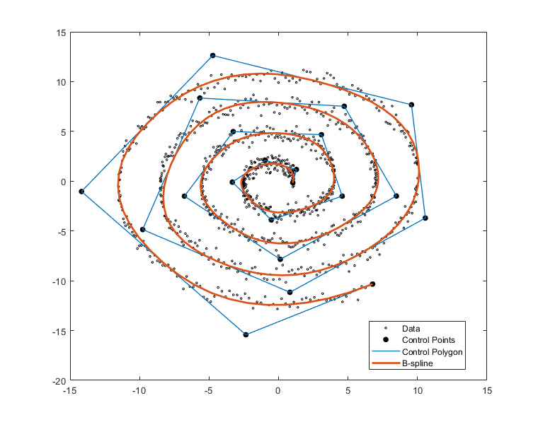
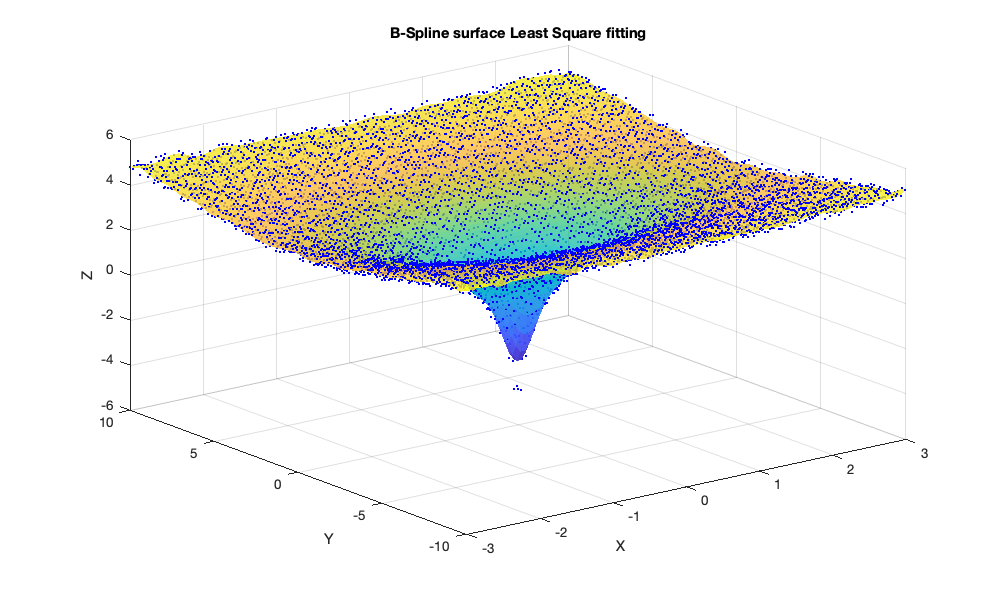
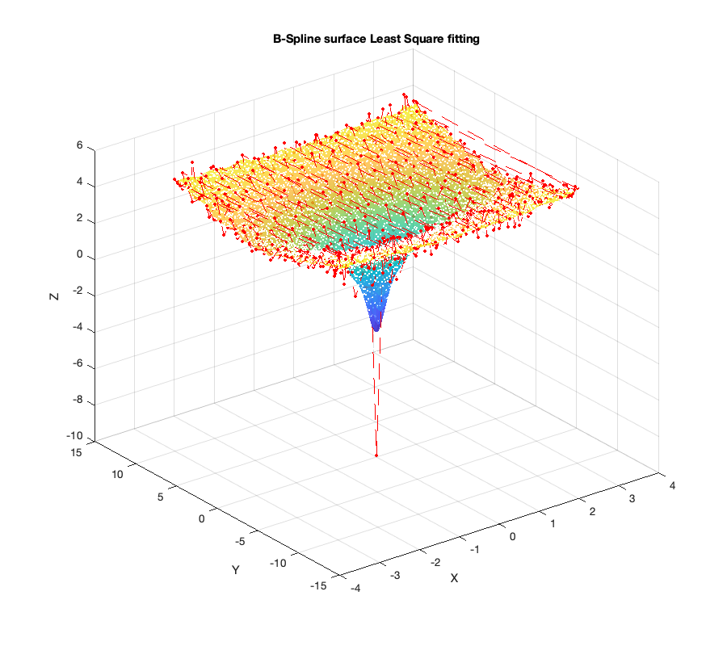

# B-spline-Curves-and-Surfaces
This repo holds some implementation and approximation of B-spline curves and surfaces.

1. [Examples](example)
2. [Notebook](https://nbviewer.jupyter.org/github/LorenzoPratesi/B-spline-Curves-and-Surfaces/blob/main/notebooks/BsplineAndLeastSquares.ipynb) - ITA

## Least Square fitting B-spline curve

## Least Square fitting B-spline surface

